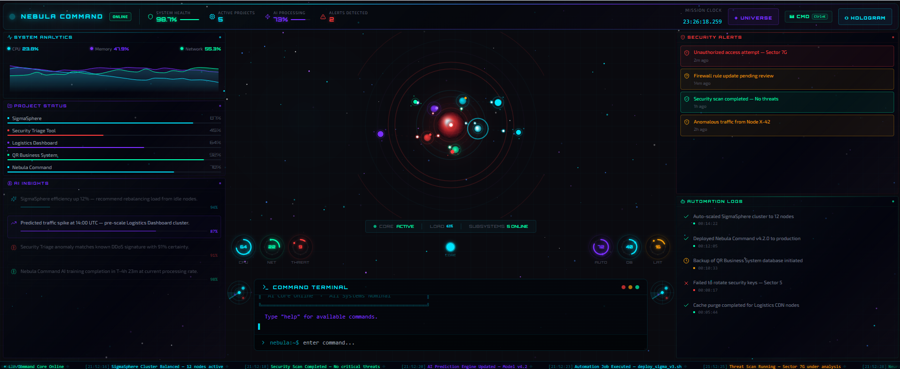
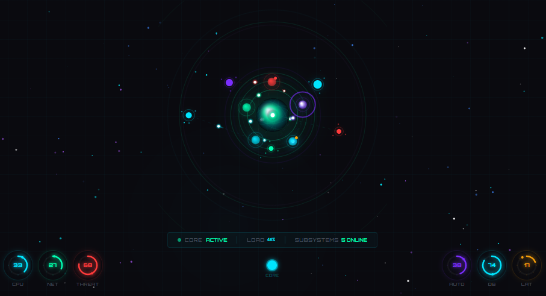
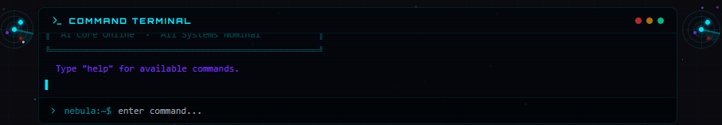
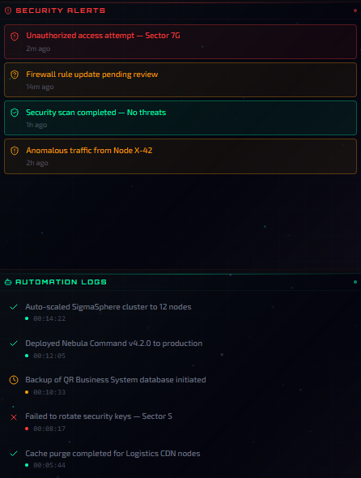

# Nebula Command

AI Operations Command Center Interface

Nebula Command is a futuristic dashboard concept designed to visualize system analytics, automation activity, security monitoring, and AI insights through a centralized neural command interface.

Instead of traditional dashboards with scattered panels, Nebula Command explores the idea of a **command-center style system interface** where multiple subsystems are orchestrated through a central AI Core.

---

## Overview

Nebula Command acts as a unified control environment where operational subsystems are monitored and controlled from a single interface.

The design centers around a **Neural AI Core**, representing the central intelligence of the system. Subsystems such as analytics, automation, and security monitoring are visually represented as nodes connected to the core.

This creates a command-console style interface similar to:

- AI operations platforms  
- cybersecurity SOC dashboards  
- DevOps control environments  
- futuristic command interfaces  

---

## Key Features

- Neural AI Core visualization  
- Orbiting subsystem nodes  
- Real-time system analytics  
- Security monitoring and alerts  
- Automation activity logs  
- AI insights panel  
- Command terminal interface  
- Live event ticker for system activity  
- System health and operational indicators  

---

## AI Core System

---

## Command Terminal

---

## Security Monitoring

---

## Concept and Design Philosophy

Nebula Command explores a future where system dashboards behave more like **AI command centers** rather than simple data panels.

Instead of navigating menus, operators interact with a visual system intelligence that connects analytics, automation, and security monitoring in one environment.

The goal is to demonstrate how operational platforms might evolve into **interactive AI-driven control environments**.

---

## Project Purpose

This project was built as a concept prototype to explore:

- AI-driven dashboard design  
- futuristic system visualization  
- command center style interfaces  
- advanced monitoring environments  

Nebula Command demonstrates how complex operational systems could be monitored through a **centralized AI control interface** rather than traditional dashboards.

---

## Future Ideas

Possible future evolutions of the platform include:

- 3D holographic AI core visualization  
- neural network system mapping  
- AI-driven system predictions  
- global system activity maps  
- interactive subsystem analytics  

---

## Project Status

Concept prototype and design exploration.
